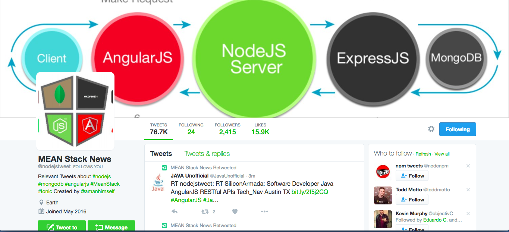
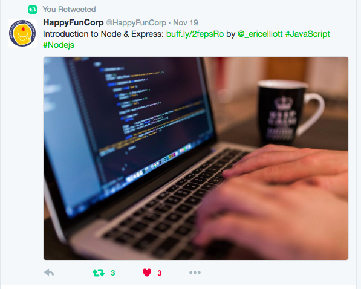
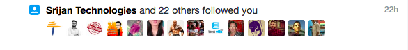
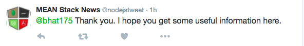

# [nodejs-tweet](https://twitter.com/nodejstweets)

Twitter bot that retweets, favorites, and replies related to Node.js, AngularJS, MongoDB, MEAN Stack, and Ionic Framework.

## What can this bot do?

#### Retweet & Like a Tweet

#### Reply to a follower (when followed)

### Pre-requisites
This bot uses the `twit` NPM package to manipulate tweets and streams and communicate with Twitter API. Please refer [documentation](https://github.com/ttezel/twit) to make substantial changes.

### Contributing
You can help out by:

Pointing out bugs/errors.

For above option(s), please create an issue so it can be addressed. New to GitHub issues? They have a pretty handy guide you can use to familiarize yourself with them.

#### If You Can Make the Change

Simply Do:

- Fork the repository
- Make your suggested change
- Make sure the code style looks similar to the existing code
- Create a pull request

### License
MIT